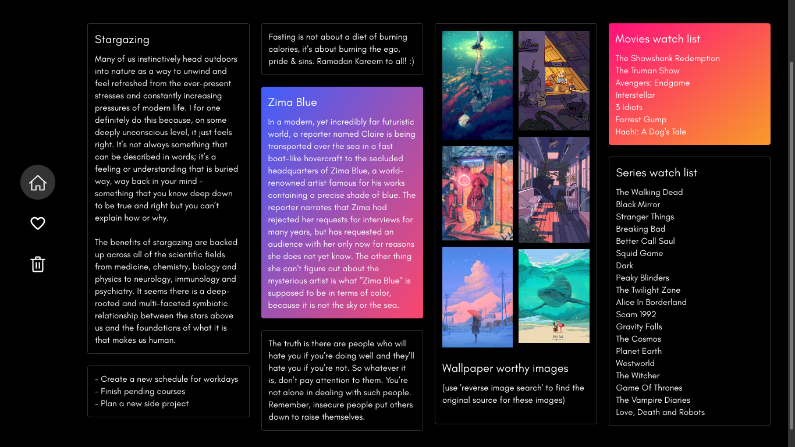
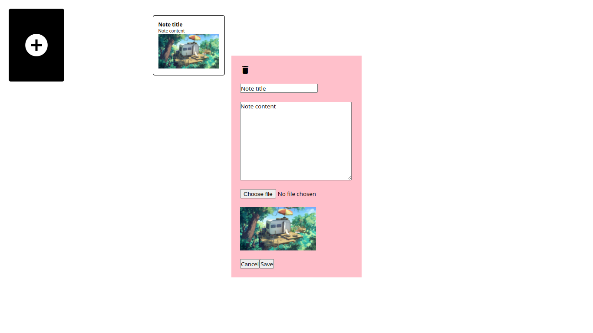
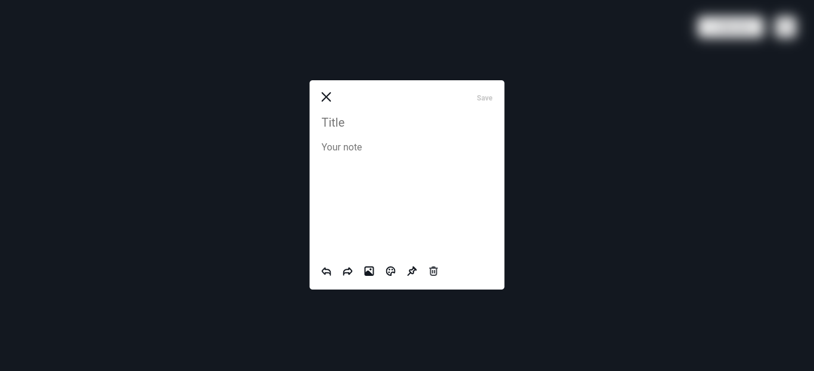
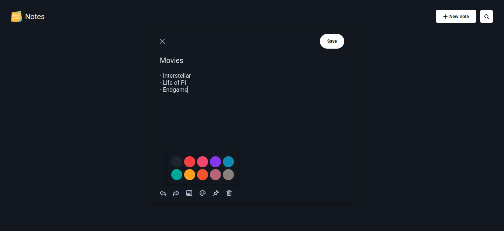
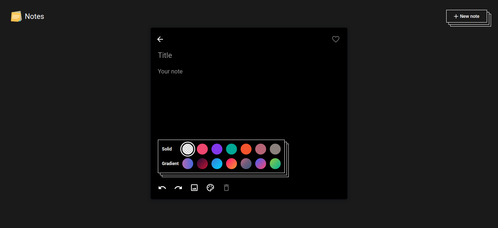
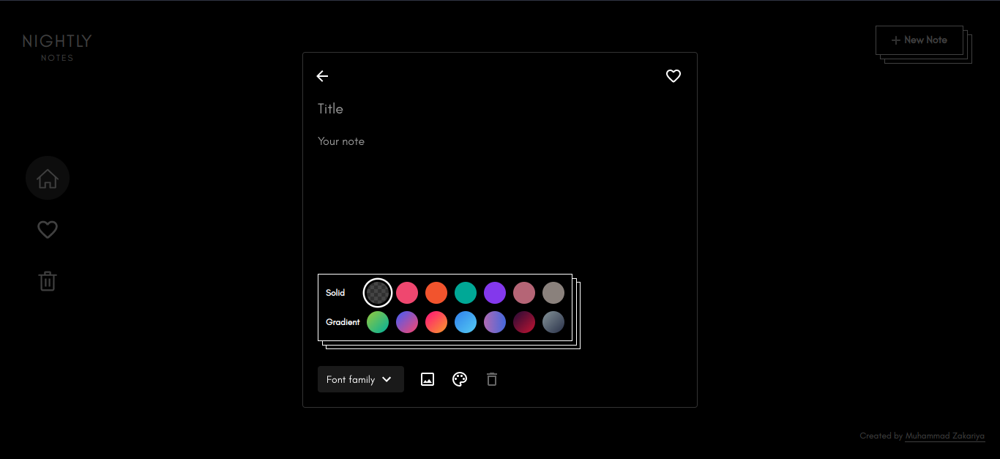

# **Notes Mini**

Notes app inspired from Google Keep

Made using -
 
- **Vue 3** - Main framework
- **Vuex** - State management
- **Vue Router** - Page routing 
- **Sass/external CSS** - Element styling

How to run in local server -
- **Clone** the respository
- **npm install** - To install project dependencies
- **npm run serve** - To start the development server
 
# **Progression**

Version 1 -

Version 2 -

Version 3 -

Version 4 -

Version 5 -

