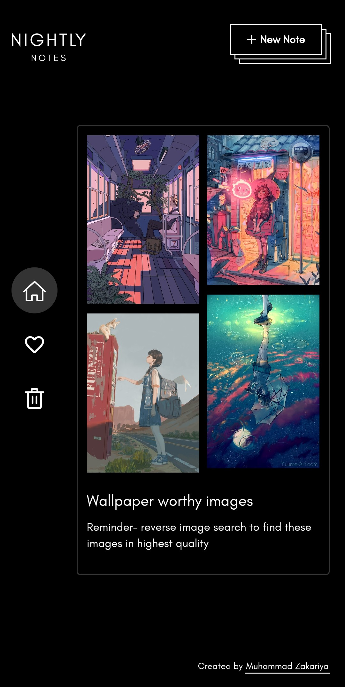

# **Nightly Notes (Vue)**

A notes-app inspired by Google Keep - made using Vue. There is also an [alternate version](https://github.com/zakariyaq313/nightly-notes-react) using React.

**Screenshot -**

**Mobile screenshots -**

	
	 
	

**Made using -**

- Vue 3
- Vuex
- Vue Router 
- Sass / SCSS
- Icon components custom made (using icons in SVG format from [Material Icons](https://fonts.google.com/icons?selected=Material+Icons) and converting them into JSX components using [SVG to JSX](https://svg2jsx.com/))
- **No additional libraries used**

**Notes -**

I always liked the simple and minimalistic design of Google Keep, and long hoped to create an application similar to it. I worked with Vue at my job, but never really got around to creating any personal project using it. So for my first app with Vue, I decided to create this notes-app. It was a great learning experience for me, and I'm satisfied with the result. I do have some improvements planned for the future, if and when I get some free time :)

I have added a little info on the app's design progression [here](./src/README.md).

**How to run in local server -**
- `Clone` the respository
- `npm install` - To install project dependencies
- `npm run serve` - To start the development server
