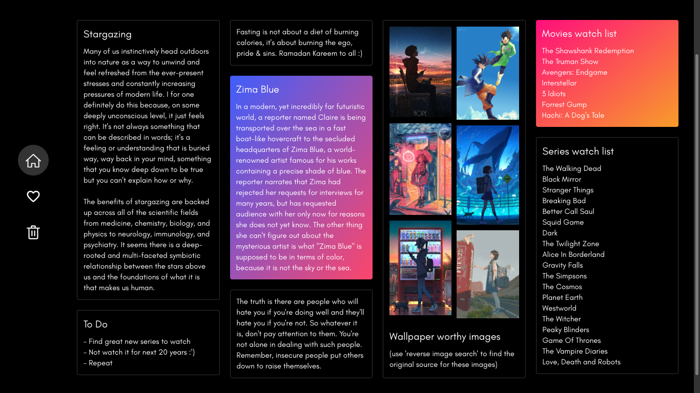

# **Nightly Notes (Vue)**

A notes application, inspired by Google Keep, built with Vue. There is also an [alternate version](https://github.com/zakariyaq313/nightly-notes-react) using React.

**Screenshot -**

**Mobile screenshots -**

	
	 
	

**Made using -**

- Vue 3
- Vuex
- Vue Router 
- Sass / SCSS
- Icon components custom-made (using icons from [Material Icons](https://fonts.google.com/icons?selected=Material+Icons))
- **No additional libraries used**

**Notes -**

I wanted to expand my knowledge and understanding of Vue, so I decided to undertake a personal project using it. I was particularly drawn to the clean and minimalistic design of Google Keep, and thus, chose to create a similar application using Vue. The process of building this project was a great learning experience as it allowed me to gain a deeper understanding of Vue and its capabilities. I am proud of the final product and satisfied with it, but also open to the idea of making further improvements to it in the future, based on user feedback or new features that I may think of.

I have added a little info on the app's design progression [here](./src/README.md).

**How to run in local server -**
- `Clone` the respository
- `npm install` - To install project dependencies
- `npm run serve` - To start the development server
