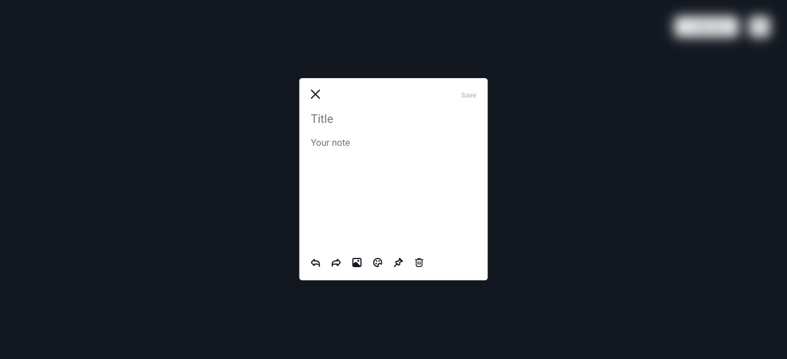
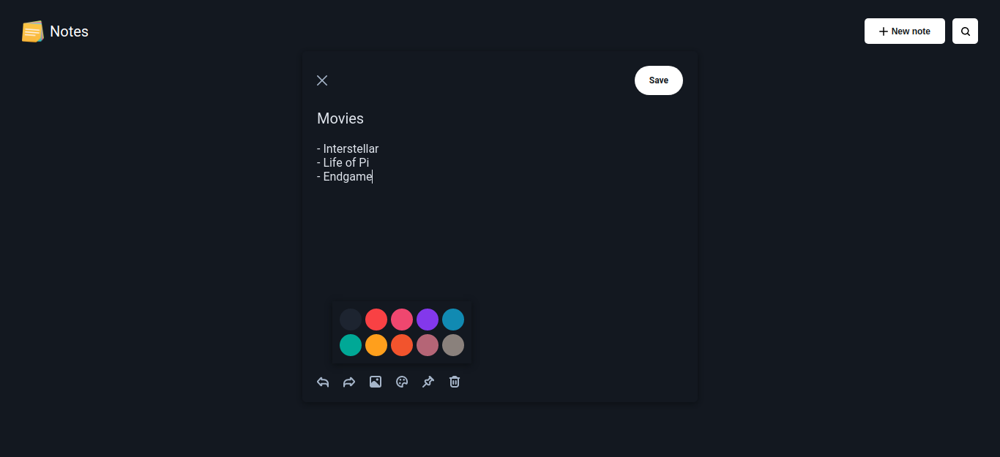
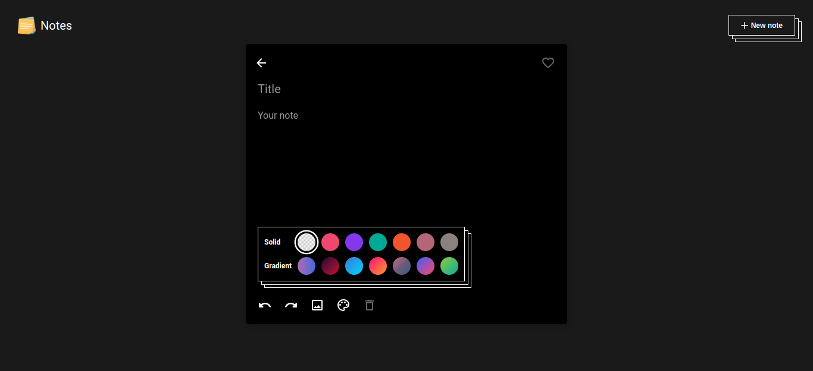
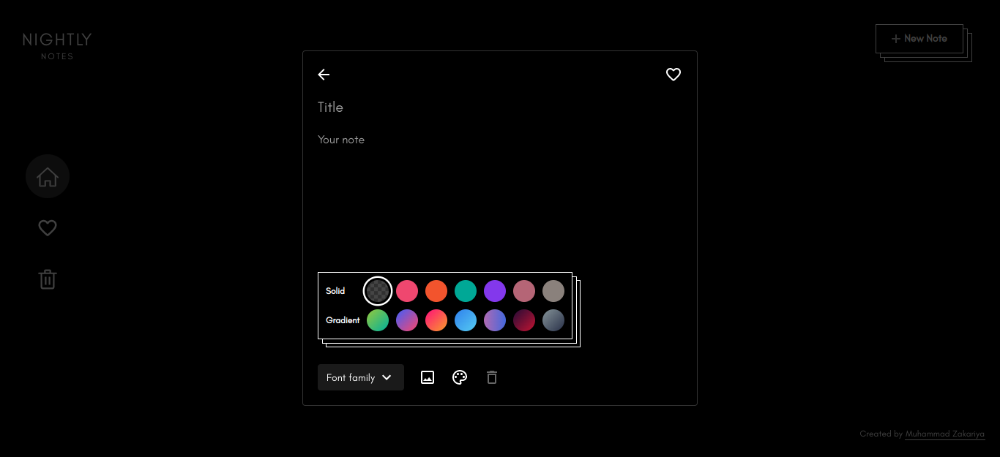

# **Design progression**

**First iteration -** Initial implementation of my version of Google Keep's design. Disappointed and almost shelved the project.

**Second iteration -** Small changes in the note dialog with big impact. Regained my motivation to continue the project.

**Third iteration -** An overall step-up to the next level but somehow lacking, missing the "it" factor.

**Fourth iteration -** Putting it all together :)

